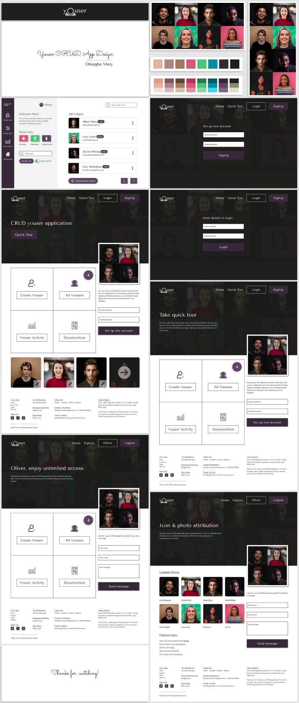

## Mary says hello 

Hi, I'm Obiagba Mary from Nigeria. Welcome to my profile page. I'm working on a new github profile so you may not find anything here for now. In the mean time, check out some projects I've worked on or developed:
- [Code collabo's node mongo CLI](https://www.npmjs.com/package/@code-collabo/node-mongo-cli)
- [Ushahidi's platform client](https://github.com/ushahidi/platform-client) and [platform pattern library](https://github.com/ushahidi/platform-pattern-library)
- [Improve the performance of the Ushahidi platform](https://www.ushahidi.com/blog/2021/07/11/think-about-your-audience)

<!--
Hi, I'm Obiagba Mary from Nigeria. Welcome to my profile page. I'm passionate about and actively contribute to open source software projects and community. A little bit about me:
- Melancholic
- Love to listen to and play acoustic guitar
- Teaching is a second nature
- Nocturnal, but can adapt to any timezone. All I need to do is move my nights to whatever time i need it to be, when it's time 🙃

## Ushahidi community
Been contributing to [Ushahidi](https://www.ushahidi.com/) since October 2020. Read about my work at Ushahidi during [Outreachy](https://www.outreachy.org/)'s May - August 2021 cohort, where I worked on the [Improve performance on the Ushahidi Platform Client](https://www.ushahidi.com/blog/2021/07/11/think-about-your-audience) project 🤓 
--> 
<!-- - hashnode version of the article [here](https://dev-obiagba.hashnode.dev/think-about-your-audience).-->

<!--

|  |
|--|

## Code Collabo community

Founded and manage [Code Collabo](https://github.com/code-collabo) since February 2021, a Free and Open Source Software community with awesome collaboration projects to provide open source experience 🙋‍♀️

| | |
|--|--|

## GADS scholarship program

Program Assistant and Mobile web specialist mentor at the Google Africa Developer Scholarship 2021 program by Google, Andela and Pluralsight - I enjoy assisting mentors and mentees in the courses and projects they are undertaking 😃

|| |
|--|--|

-->

## Blogging and social media
I love to write about my experiences on my personal [dev-obiagba.hashnode.dev](https://dev-obiagba.hashnode.dev/) blog. I am [@Ifycode](https://github.com/Ifycode) on github, [@obiagba_mary](https://twitter.com/obiagba_mary) on twitter and you can find me on linkedIn with the name [Mary Obiagba](https://www.linkedin.com/in/mary-obiagba-b7a2491a6/) 🙋‍♀️

## Github stats

 

<!--
## Mary says hello 
Hi, I'm Obiagba Mary from Nigeria. Welcome to my profile page. I'm a software engineer and technical writer, who is passionate about and actively contribute to open source software projects and community. I'm currently open to work. Check out some projects I've made and open source communities I've contributed to below.

## Code Collabo community

| | |
|--|--|

Founded [Code Collabo](https://github.com/code-collabo) in February 2021, a Free and Open Source Software community with awesome collaboration projects to provide support and open source experience. Everyone having knowledge of CSS, SCSS and/or LESS preprocessors, javascript, nodejs and/or mongoDB is welcome to contribute to collabo projects. See the [documentation guide](https://code-collabo.gitbook.io/doc/) to learn more about the community and how to contribute to on-going projects.
Checkout some released projects:
- [@code-collabo/node-mongo-cli](https://www.npmjs.com/package/@code-collabo/node-mongo-cli) 🥳
- [@code-collabo/less-css-helper-library](https://www.npmjs.com/package/@code-collabo/less-css-helper-library) 🥳
- [code-collabo documentation guide](https://code-collabo.gitbook.io/doc/) 📖
- [node-mongo documentation guide](https://code-collabo.gitbook.io/node-mongo/) 📖

## Ushahidi community
Read about my work at [Ushahidi](https://www.ushahidi.com/) during [Outreachy](https://www.outreachy.org/)'s May - August 2021 cohort, where I worked on the [Improve performance on the Ushahidi Platform Client](https://www.ushahidi.com/blog/2021/07/11/think-about-your-audience) project - hashnode version of the article [here](https://dev-obiagba.hashnode.dev/think-about-your-audience). Check out [the GitHub project board](https://github.com/ushahidi/platform/projects/17) on the Ushahidi Platform. You can also check out my [Outreachy internship wrap-up article](https://www.ushahidi.com/blog/2021/08/30/outreachy-internship-wrap-up) on the ushahidi blog - hashnode version of the article [here](https://dev-obiagba.hashnode.dev/outreachy-internship-wrap-up).

## GADS scholarship program

|| |
|--|--|

Volunteering as a mobile web specialist mentor at the Google Africa Developer Scholarship program has been awesome. Spend time assisting and building projects for and/or alongside mentees assigned to me. Check the out: the [solve js single page application](https://github.com/gads-projects/solve-js) (built without any framework) containing javascript tasks with command-line git exercises, and the [GADS gallery and documentation project](https://obiagba-mary.gitbook.io/gads-projects/) to expose mentors and mentees to open source contribution and the github web interface.

## Github stats

 

-->

<!--
|  [node-mongo CLI](https://code-collabo.gitbook.io/node-mongo/)|  [solve-js spa](https://github.com/gads-projects/solve-js)|
|--|--|

|  [scss-helper-library](https://github.com/code-collabo/scss-helper-library)|  [youser app design](https://www.behance.net/gallery/113409717/Youser-App) |
|--|--|
-->

<!--
## Ushahidi community

-->

<!--

***Blog:***
* [Quick, effective and efficient way to test your separately hosted css library on your client, during development](https://dev-obiagba.hashnode.dev/quick-effective-and-efficient-way-to-test-your-separately-hosted-css-library-on-your-client-during-development-1)

## Non-tech posts
* [While you wait for God's healing...](https://dev-obiagba.hashnode.dev/while-you-wait-for-gods-healing)
-->

<!--
Join us build awesome, real world, open source projects which will benefit both contributors & users alike. The current project we are working on aims to make the work of mongoDB, MERN and MEAN stack developers easier. At the same time, it aims to promote collaboration, provide problem solving, open source, internship & remote experience for contributors. See [project readme](https://github.com/code-collabo/node-mongo-cli) for more details.
-->

<!--

 [@Ifycode](https://github.com/Ifycode)\
 [@obiagba_mary](https://twitter.com/obiagba_mary?s=09)

 [@code-collabo](https://github.com/code-collabo)

I’m currently working on one my portfolio projects - youser app (using figma + MEAN stack) 👇🏽

- 🌱 I’m currently learning about CS, web design and mongoDB.
- 👯 I’m looking to collaborate on projects that involve angular.
- ⚡ Fun fact: I and my acoustic bluemay 😍 (acoustic guitar 🎸) are one 😌.
- 💬 Ask me about... 🤔
- 📫 How to reach me: obiagba.mary.ifeoma@gmail.com

**Technologies:**

-->

<!--
|  |  |
|------------------|------------------|

|<ul><li>Github => [@Ifycode](https://github.com/Ifycode)</li><li>Twitter => [@obiagba_mary](https://twitter.com/obiagba_mary?s=09)</li></ul>|
|:--- |

|  |
|------------------|
Youser Landing Page

|Youser Moodboard|Youser Home|
-->

<!--

| Add more content soon |
|---------------------- |

| Add Image A | Add Image B |
|------------ | ----------- |

|  | Add Image B |
|--------- | -------- |

**Ifycode/Ifycode** is a ✨ _special_ ✨ repository because its `README.md` (this file) appears on your GitHub profile.

Here are some ideas to get you started:

- 🔭 I’m currently working on ...
- 🌱 I’m currently learning ...
- 👯 I’m looking to collaborate on ...
- 🤔 I’m looking for help with ...
- 💬 Ask me about ...
- 📫 How to reach me: ...
- 😄 Pronouns: ...
- ⚡ Fun fact: ...
-->
